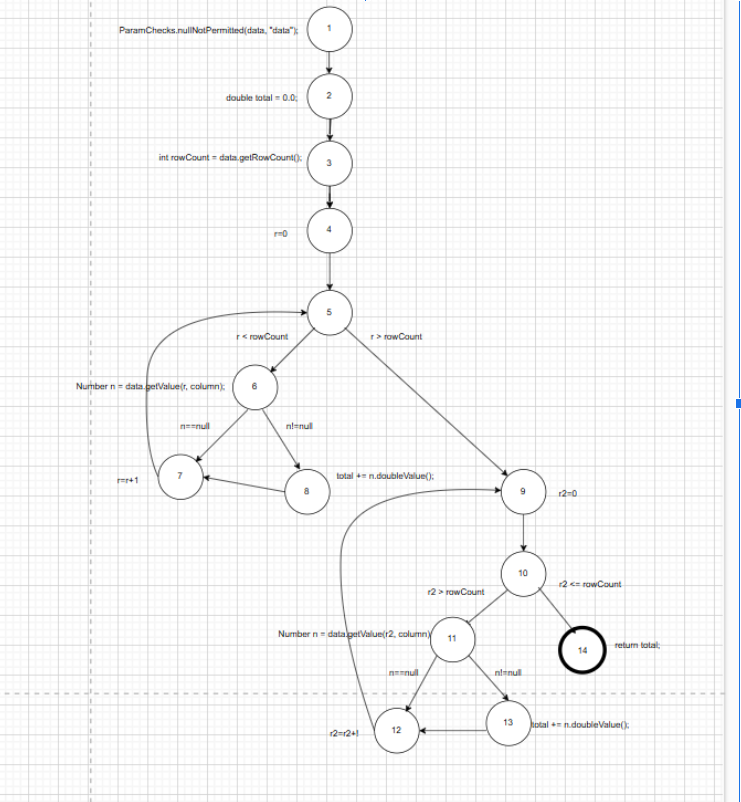
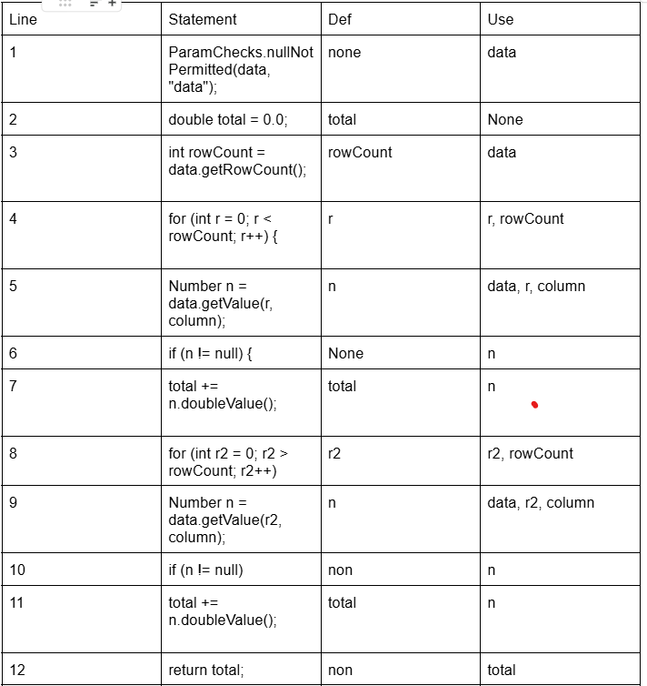
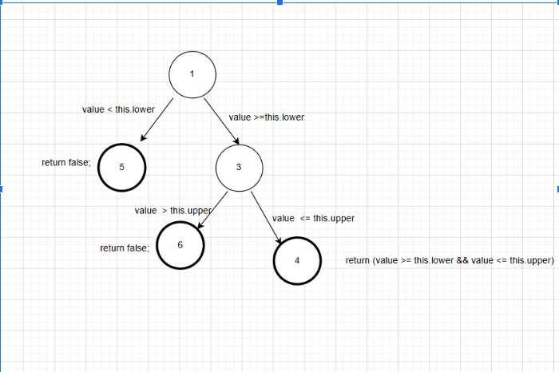
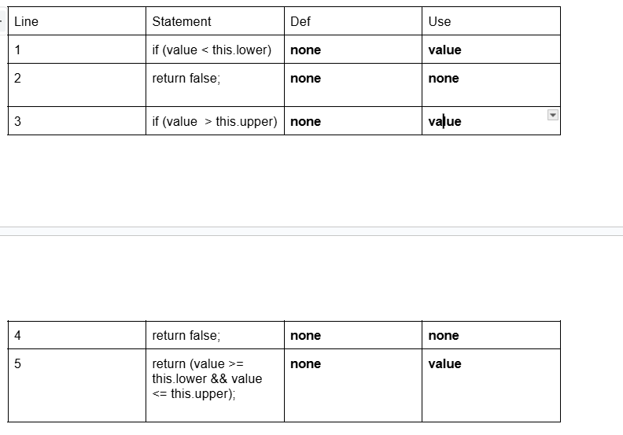

**SENG 438 - Software Testing, Reliability, and Quality**

**Lab. Report #3 – Code Coverage, Adequacy Criteria and Test Case Correlation**

| Group \#: 2     |     |
| -------------- | --- |
| Student Names: |     |
|      Qasim Amar          |     |
|      Said Rahmani          |     |
|             Ahmed Addullah
|    Muhammad Bilal |

(Note that some labs require individual reports while others require one report
for each group. Please see each lab document for details.)

# 1 Introduction
For this lab we were assigned to get familiar with testing coverage tools, were we used EclEmma. By using different techniques in this lab to decide which test cases must be developed, compared to previous assignments we used white-box testing in order to improve coverage for previously developed test cases. Furthermore, during the design phase we took a look at the DataUtilities.calculateColumnTotal and Range.contains class to manually develop data flow coverage. Lastly we showcase the DU-pairs per variable, showing the coverage from the previous assignments test cases.

# 2 Manual data-flow coverage calculations for X and Y methods
Method 1: DataUtilities.calculateColumnTotal
Data flow graph:

DEF-USE per statement: 

list all DU-pairs per variable:
1 . Variable : data
Def: Line 1 (passed as a parameter).
Use:
Line 3: data.getRowCount().
Line 5: data.getValue(r, column).
Line 9: data.getValue(r2, column).
DU-Pairs:
(Line 1 → Line 3)
(Line 1 → Line 5)
(Line 1 → Line 9)

2 . Variable : column
Def: Line 1 (passed as a parameter).
Use:
Line 5: data.getValue(r, column).
Line 9: data.getValue(r2, column).

DU-Pairs:
(Line 1 → Line 5)
(Line 1 → Line 9)

3 . Variable : total
Def:
Line 2: double total = 0.0;.
Line 7: total += n.doubleValue();.
Line 11: total += n.doubleValue();
Use:
Line 7: total += n.doubleValue();.
Line 11: total += n.doubleValue();.
Line 12: return total;.
DU-Pairs:
(Line 2 → Line 7)
(Line 2 → Line 11)
(Line 2 → Line 12)
(Line 7 → Line 7)
(Line 7 → Line 11)
(Line 7 → Line 12)
(Line 11 → Line 11)
(Line 11 → Line 12)

4 . Variable : rowCount
Def: 
Line 3: int rowCount = data.getRowCount();.

Use:
Line 4: r < rowCount.
Line 8: r2 > rowCount.

DU-Pairs:
(Line 3 → Line 4)
(Line 3 → Line 8)

5 . Variable : r
Def:
Line 4: int r = 0;.
Line 4: r++ 

Use:
Line 4: r < rowCount.
Line 5: data.getValue(r, column).

DU-Pairs:
(Line 4 → Line 4)
(Line 4 → Line 5)

6. Variable : n
Def:
Line 5: Number n = data.getValue(r, column);.
Line 9: Number n = data.getValue(r2, column);.

Use:
Line 6: if (n != null).
Line 7: total += n.doubleValue();.
Line 10: if (n != null).
Line 11: total += n.doubleValue();.

DU-Pairs:
(Line 5 → Line 6)
(Line 5 → Line 7)
(Line 9 → Line 10)
(Line 9 → Line 11)

7. Variable : r2
Def:
Line 8: int r2 = 0;.
Line 8: r2++ (implicit update in the loop).

Use:		
Line 8: r2 > rowCount.
Line 9: data.getValue(r2, column).

DU-Pairs:
(Line 8 → Line 8)
(Line 8 → Line 9)

For each test case show which pairs are covered:
Test Case 1: calculateColumnTotalForTwoValues
Input: values = 7.5, 2.5, column = 0

Execution Path:
Line 1: Mocking values.getRowCount() returns 2, meaning there are two rows.
Line 3: Mocking values.getValue(0, 0) returns 7.5 for the first value in the first row.
Line 5: Mocking values.getValue(1, 0) returns 2.5 for the second value in the second row.
Line 6: The method proceeds to accumulate the sum.
Line 8: The total sum (7.5 + 2.5) is 10.0.
Line 9: The method returns 10.0.

Covered DU-Pairs:

-values (Values2D):
(Class definition → Line 1) → values.getRowCount()
(Class definition → Line 3) → values.getValue(0, 0)
(Class definition → Line 5) → values.getValue(1, 0)

-column (Column index):
(Line 1 → Line 3) → values.getValue(0, 0)
(Line 1 → Line 5) → values.getValue(1, 0)

-total (The accumulator for the sum):
(Line 2 → Line 6) → total += n.doubleValue()
(Line 2 → Line 8) → total += n.doubleValue()
(Line 2 → Line 9) → return total

-r (Row index):
(Line 4 → Line 5) → values.getValue(r, column)
(Line 4 → Line 6) → total += n.doubleValue()

-n (Value retrieved from the Values2D object):
(Line 5 → Line 6) → n != null
(Line 5 → Line 6) → total += n.doubleValue()

Test Case 2: calculateColumnTotalForNullValues
Input: values with 0 rows (empty)

Execution Path:
Line 1: Mocking values.getRowCount() returns 0, meaning there are no rows.
Line 3: Since there are no rows, the method doesn't enter the loop.
Line 4: total remains 0.0 (initial value).
Line 9: The method returns 0.0.
Covered DU-Pairs:
-values (Values2D):
(Class definition → Line 1) → values.getRowCount()

-column (Column index):
(Line 1 → Line 3) → Skipped, no values to iterate over

-total (The accumulator for the sum):
(Line 2 → Line 9) → return total

Calculate the DU-Pair coverage:
CU=8 , PU=8

Method 2: org.jfree.data.Range.contains
Data flow graph:

DEF-USE per statement: 

List all DU-pairs per variable: 

1.Variable:value
Def:
 Line 1 (passed as a parameter).

Use:
Line 1: value < this.lower.
Line 3: value > this.upper.
Line 5: value >= this.lower && value <= this.upper.

DU-Pairs:
(Line 1 → Line 1)
(Line 1 → Line 3)
(Line 1 → Line 5)

For each test case show which pairs are covered:

Test Case 1: testContains_WithinRange
Input: value = 6.0, range = [5.0, 10.0].

Execution Path:
Line 1: 6.0 < 5.0 → false.
Line 3: 6.0 > 10.0 → false.
Line 5: 6.0 >= 5.0 && 6.0 <= 10.0 → true.
Returns true
Covered DU-Pairs:
value: (Line 1 → Line 1), (Line 1 → Line 3), (Line 1 → Line 5).
this.lower: (Class definition → Line 1), (Class definition → Line 5).
this.upper: (Class definition → Line 3), (Class definition → Line 5).

Test Case 2: testContains_AtLowerBoundary
Input: value = 5.0, range = [5.0, 10.0].

Execution Path:
Line 1: 5.0 < 5.0 → false.
Line 3: 5.0 > 10.0 → false.
Line 5: 5.0 >= 5.0 && 5.0 <= 10.0 → true.
Returns true

Covered DU-Pairs:
value: (Line 1 → Line 1), (Line 1 → Line 3), (Line 1 → Line 5).
this.lower: (Class definition → Line 1), (Class definition → Line 5).
this.upper: (Class definition → Line 3), (Class definition → Line 5).

Test Case 3: testContains_AtUpperBoundary
Input: value = 10.0, range = [5.0, 10.0].

Execution Path:
Line 1: 10.0 < 5.0 → false.
Line 3: 10.0 > 10.0 → false.
Line 5: 10.0 >= 5.0 && 10.0 <= 10.0 → true.
Returns true.

Covered DU-Pairs:
value: (Line 1 → Line 1), (Line 1 → Line 3), (Line 1 → Line 5).
this.lower: (Class definition → Line 1), (Class definition → Line 5).
this.upper: (Class definition → Line 3), (Class definition → Line 5).

Test Case 4: testContains_OutsideRange
Input: value = 11.0, range = [5.0, 10.0].

Execution Path:
Line 1: 11.0 < 5.0 → false.
Line 3: 11.0 > 10.0 → true.
Returns false.

Covered DU-Pairs:
value: (Line 1 → Line 1), (Line 1 → Line 3).
this.lower: (Class definition → Line 1).
this.upper: (Class definition → Line 3).

Calculate the DU-Pair coverage:
CU=4,PU=4

# 3 A detailed description of the testing strategy for the new unit test

Text…

# 4 A high level description of five selected test cases you have designed using coverage information, and how they have increased code coverage

Text…

# 5 A detailed report of the coverage achieved of each class and method (a screen shot from the code cover results in green and red color would suffice)

Text…

# 6 Pros and Cons of coverage tools used and Metrics you report
Using the tool recommended which was EclEmma it was easy to get started with as we already had it installed on Eclipse. However upon use we saw EclEmma does not explicitly show statement and condition coverage which we ended up using method and line coverage instead. Overall it was easy to use and still provided us the tools to see how coverages changed for test cases.

# 7 A comparison on the advantages and disadvantages of requirements-based test generation and coverage-based test generation.
Over these last two assignments, we have been able to take a look a requirement-based (black-box) and coverage-based (white-box) testing. In terms of requirement-based testing, we looked at code documentation where each method had its requirements written out. Based on this we had to write test cases without looking at the actual source code, but rather develop test cases based on the method functionalities listed. Although this method was relatively simple to implement, due to not looking at the actual source code the chance of not covering edge cases is more likely hence a reduction in coverage.

Comparing this to coverage-based testing we can implement full coverage by analyzing the source code. By doing so we can make sure edge cases are covered. However, this method is more challenging and requires a deeper understanding of how the code functions. After using both methods we were able to see the advantages and disadvantages that come with each method of test generation.

# 8 A discussion on how the team work/effort was divided and managed
Compared to previous assignments we decided to split this one in a way everyone works over the same thing. For 3.2 we all worked together to create the data flow graphs and the respective tables. Furthermore, for the testing portion we all worked together to measure coverages and improve test cases. Using this method we were all able to work on everything and gain knowledge from each section. Furthermore, if we encountered any problems being able to collectivly brainstorm was very effective in solving any issuues.

# 9 Any difficulties encountered, challenges overcome, and lessons learned from performing the lab
During the time we were doing section 3.2 it was hard to understand how to obtain the def-use sets. However after coming together and some more research we were able to get it done. This lab allowed us the learn the concepts of white-box testing to imporove test case coverages and implement what we learned in the lectures to create data flow diagrams and DU-pairs.

# 10 Comments/feedback on the lab itself
As the start navigating through the lab was pretty hard and somehwat confusing. Since it was divided into different sections of what needed to be done, we had a hard time understanding at first. However, after coming together and carfully reviewing each step it became easier to navigate.
